
CenTFinder workflow
===================

Description
-----------

The CenTFinder workflow was designed to combine different types of
transcriptomics analyses in order to identify transcription factors
(TFs) and pathways that are crucial in a given biological context
(CENTral Transcription Factor FINDER). Conventionally, lists of
differentially expressed genes and TFs are used to assign a ranking of
TF or gene importance based on fold change or p-value. However, genes
might be differentially expressed between conditions due to several
confounding factors aside from biological differences. Such differences
may arise from culturing conditions, primary cell extraction procedures,
and the purity of primary samples. The latter issue can be resolved by
using single-cell RNA sequencing data. However, single-cell RNA
sequencing experiments can be costly. Fortunately, there is an abundant
source of microarray and bulk RNA sequencing expression data already
publicly available. Here, we designed a workflow that allows researchers
to perform vast meta-analyses on these data types. This allows stronger
statistical inferences and often allows to analyse more diverse datasets
than currently feasible with single-cell RNA sequencing. Specifically, a
typical meta-analysis includes gene co-expression analysis (using WGCNA
<http://https://horvath.genetics.ucla.edu/html/CoexpressionNetwork/Rpackages/WGCNA/>),
transcription factor binding motif enrichment analysis (using RcisTarget
<https://bioconductor.org/packages/release/bioc/html/RcisTarget.html>),
and classical differential expression analysis (using microarray data,
bulk RNA sequencing data, or single-cell RNA sequencing data). While
overlaps can be made with single-cell RNA sequencing results, the data
used for gene co-expression and subsequent steps should come from
microarray or bulk RNA sequencing data. RT-qPCR data, TempO-Seq data
(<https://www.biospyder.com/technology>), or similar data sources may
also be used if a sufficient number of genes is included. For similar
research questions using single-cell RNA sequencing data, we would like
to refer to the SCENIC pipeline (<https://github.com/aertslab/SCENIC>).

Here below, we provide a tutorial for the CenTFinder analysis workflow
using endothelial cell expression data. This analysis is equivalent to
the one published in XXXXXX.

Installation
------------

Install and load the package by running:

    BiocManager::install("devtools")
    devtools::install_github("jonathandesmedt92/CenTFinder")
    library(CenTFinder)

CenTFinder workflow tutorial: endothelial cells meta-analysis
-------------------------------------------------------------

### CenTFinder step 1: Querying and downloading expression data

In this step we will query the ArrayExpress database for microarray data
of interest (i.e. endothelial cell data with specific interest).

1.  We define relevant query terms:

<!-- -->

    query_terms<-c("endothelial cell AND Homo sapiens","LSEC AND Homo sapiens")

1.  We retrieve the ArrayExpress accession numbers by:

<!-- -->

    response<-getAE_accession_codes(query=query_terms)

    response[1:5]

    ## [1] "E-MTAB-8817" "E-MTAB-8272" "E-MTAB-7896" "E-MTAB-7889" "E-MTAB-7878"

1.  We retrieve the sample and data relation file (SDRF) from selected
    accession numbers.

<!-- -->

    sdrf<-getBatchSDRF(AEcodes=response, technology = "array", label = "biotin")

1.  After manually inspecting the resulting SDRF data, and filtering if
    needed, and download selected expression data by running:

<!-- -->

    downloadAE(AEcodes=unique(res$AEcode))

1.  Studies can contain both expression data of interest and expression
    data that is not relevant for your research question. In this step
    you can filter the expression data based on keywords for samples to
    include as well as keywords for samples to exclude. Internally these
    keywords are matched using general regex.

<!-- -->

    include=c("endothelial","LSEC","liver sinusoidal endothelial cell")
    exclude=c("oma","tumor","tumour","cancer","malignant")

    filterAEdata(sdrf = res, path="data.downloads",species = "Homo sapiens", keywords = include, exclusion_keywords=exclude)

### CenTFinder step 2: Preprocessing the expression data

In this step, the user initialises a CenTFinder object and loads a clean
expression matrix (i.e. genes in the rows and samples in the columns).
This expression matrix can contain log2(intensity) values
from microarray data, log2(TPM+1) values from bulk RNA
sequencing data, or log2(CPM) values from TempoSeq data.

A CenTFinder object can easily be initialised by running:

    ctf<-CenTFinder()

In the case of a microarray meta-analysis, CenTFinder offers the
functionality to analyse, normalise, and batch-correct starting from the
raw CEL files. Currently, CenTFinder only supports Affymetrix
microarrays. For other microarray platforms and bulk RNA sequencing
data, the user is encouraged to prepare the expression matrices with the
appropriate pipelines and to load it in an initialised CenTFinder
object.

In either case, one should prepare a sample annotation dataframe
`annotation`. A minimal example:

<table>
<caption>An example of an annotation file.</caption>
<thead>
<tr class="header">
<th align="left">filenames</th>
<th align="left">celltype</th>
<th align="left">AEcode</th>
</tr>
</thead>
<tbody>
<tr class="odd">
<td align="left">HUVEC_scr_siRNA_1.CEL</td>
<td align="left">umbilical vein;endothelial cell of umbilical vein;HUVEC cell line</td>
<td align="left">E-MTAB-7774</td>
</tr>
<tr class="even">
<td align="left">HUVEC_USP10_siRNA_DLL4_1.CEL</td>
<td align="left">umbilical vein;endothelial cell of umbilical vein;HUVEC cell line</td>
<td align="left">E-MTAB-7774</td>
</tr>
<tr class="odd">
<td align="left">HUVEC_USP10_siRNA_DLL4_2.CEL</td>
<td align="left">umbilical vein;endothelial cell of umbilical vein;HUVEC cell line</td>
<td align="left">E-MTAB-7774</td>
</tr>
<tr class="even">
<td align="left">HUVEC_USP10_siRNA_DLL4_3.CEL</td>
<td align="left">umbilical vein;endothelial cell of umbilical vein;HUVEC cell line</td>
<td align="left">E-MTAB-7774</td>
</tr>
<tr class="odd">
<td align="left">HUVEC_scr_siRNA_2.CEL</td>
<td align="left">umbilical vein;endothelial cell of umbilical vein;HUVEC cell line</td>
<td align="left">E-MTAB-7774</td>
</tr>
<tr class="even">
<td align="left">HUVEC_scr_siRNA_3.CEL</td>
<td align="left">umbilical vein;endothelial cell of umbilical vein;HUVEC cell line</td>
<td align="left">E-MTAB-7774</td>
</tr>
<tr class="odd">
<td align="left">HUVEC_scr_siRNA_DLL4_1.CEL</td>
<td align="left">umbilical vein;endothelial cell of umbilical vein;HUVEC cell line</td>
<td align="left">E-MTAB-7774</td>
</tr>
<tr class="even">
<td align="left">HUVEC_scr_siRNA_DLL4_2.CEL</td>
<td align="left">umbilical vein;endothelial cell of umbilical vein;HUVEC cell line</td>
<td align="left">E-MTAB-7774</td>
</tr>
<tr class="odd">
<td align="left">HUVEC_scr_siRNA_DLL4_3.CEL</td>
<td align="left">umbilical vein;endothelial cell of umbilical vein;HUVEC cell line</td>
<td align="left">E-MTAB-7774</td>
</tr>
<tr class="even">
<td align="left">HUVEC_USP10_siRNA_1.CEL</td>
<td align="left">umbilical vein;endothelial cell of umbilical vein;HUVEC cell line</td>
<td align="left">E-MTAB-7774</td>
</tr>
</tbody>
</table>

Loading expression data can be done by running:

    ctf<-loadExpression(CenTFinderObject = ctf, 
                        expr = data, 
                        colData = annotation, 
                        ID_type = "ENSEMBL", 
                        species = "Homo sapiens")

CenTFinder's microarray analysis occurs in a few steps:

    # Define the path where the microarrays are stored.
    path = "data.downloads/"

    # Extract the microarray platform info
    ctf<-getPlatformInfo(ctf, filenames=annotation$filenames, path = path, platform_freq_cutoff = 0.00258)

    # Provide probe annotation data if necessary. These can be downloaded on the Affymetrix website (e.g. <http://www.affymetrix.com/support/technical/byproduct.affx?product=hugene-1_0-st-v1>)
    library(data.table)
    hugene10<-fread("HuGene-1_0-st-v1.na36.hg19.transcript.csv")
    hugene10<-hugene10[hugene10$gene_assignment!="---",]
    hugene10$gene_assignment<-trimws(sapply(strsplit(hugene10$gene_assignment, split="//"),FUN=function(x){x[2]}))

    hugene20<-fread("HuGene-2_0-st-v1.na36.hg19.transcript.csv")
    hugene20<-hugene20[hugene20$gene_assignment!="---",]
    hugene20$gene_assignment<-trimws(sapply(strsplit(hugene20$gene_assignment, split="//"),FUN=function(x){x[2]}))

    huex10<-fread("HuEx-1_0-st-v2.na36.hg19.transcript.csv")
    huex10<-huex10[huex10$gene_assignment!="---",]
    huex10$gene_assignment<-trimws(sapply(strsplit(huex10$gene_assignment, split="//"),FUN=function(x){x[2]}))

    ctf<-loadProbeAnnotation(ctf,
                              platform = "HuGene-1_0-st-v1",
                              probes = hugene10$transcript_cluster_id,
                              symbols = hugene10$gene_assignment)
    ctf<-loadProbeAnnotation(ctf,
                             platform = "HuGene-2_0-st",
                             probes = hugene20$transcript_cluster_id,
                             symbols = hugene20$gene_assignment)
    ctf<-loadProbeAnnotation(ctf,
                             platform = "HuEx-1_0-st-v2",
                             probes = huex10$transcript_cluster_id,
                             symbols = huex10$gene_assignment)

    # Provide sample and group annotation (File_name,Cell_type)
    ctf<-setArrayAnnotations(ctf, files = annotation$filenames, groups = annotation$celltype_label, AEcodes = annotation$AEcode)

    # Analyse microarrays
    ctf<-analyseMicroarrays(CenTFinderObject = ctf, 
                            platforms_keep = "HG-U219", 
                            sig = 0.05, 
                            statistic = "Wilcoxon")

    # Balance the sample categories. We obtained a lot of HUVEC and coronary artery endothelial cell samples. We decided to remove some of those.
    sum(grepl(getSampleNames(ctf),pattern="HUVEC"))
    sum(grepl(getSampleNames(ctf),pattern="coronary"))

    remove<-grepl(getSampleNames(ctf),pattern = "HUVEC")
    remove<-which(remove)
    set.seed(24)
    remove<-sample(remove,117)

    ctf<-removeSamples(ctf,samples=remove)

At this point, we can already explore some basic statistics about our
analysis. In this way, we can visualise:

1.  the number of arrays per microarray platform

<!-- -->

    plot(ctf, aspect = "array distribution")

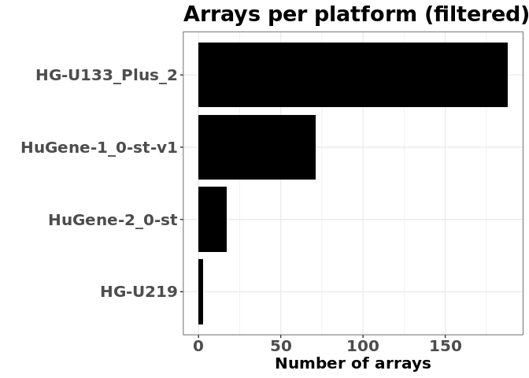

1.  the number of arrays per cell type

<!-- -->

    plot(ctf, aspect = "group distribution")

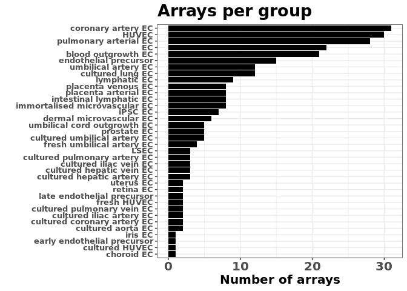

1.  the expression of one or more genes of interest in one, more, or all
    of the cell types

<!-- -->

    plot(ctf, aspect = "expression", genes = "FCGR2B", celltypes = "all", units = "log2(intensity)")

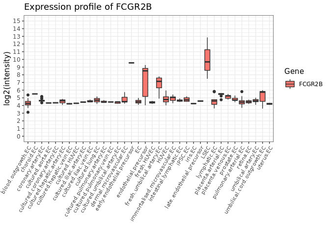

1.  the fold changes of identified markers or highly expressed
    transcription factors (cell type of interest versus all other cell
    types)

<!-- -->

    options(scipen=999)
    plot(ctf, aspect = "markers", celltype = "LSEC", n = 40, units = "fc", labels=NULL, minimal=T, rotate=T)

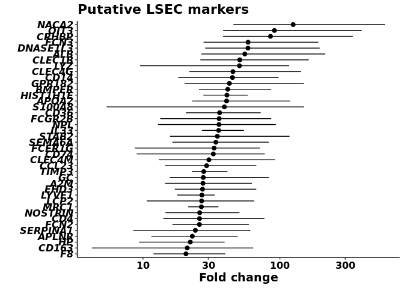

    plot(ctf, aspect = "markers", celltype = "LSEC", n = 40, units = "fc", colours=c("#FF0000","#00FF00") ,labels=c("LSECs","Other ECs"), minimal=F, rotate=T)

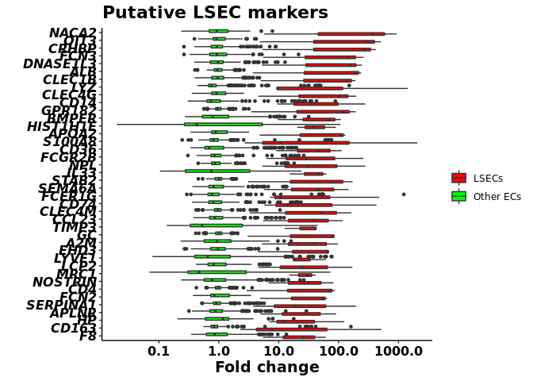

    plot(ctf, aspect = "markers", celltype = "LSEC", n = 40, units = "fc", colours=c("#FF0000","#00FF00") ,labels=c("LSECs","Other ECs"), minimal=F, rotate=F)

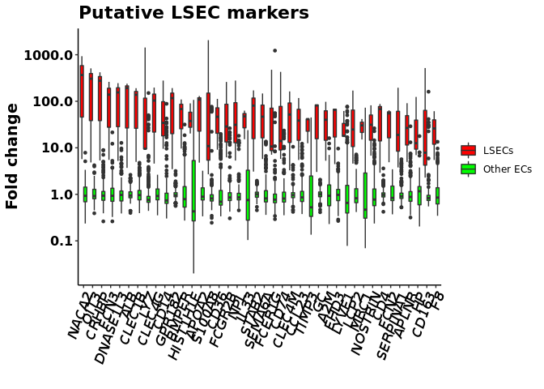

    plot(ctf, aspect = "tfs", tfs = humantfs, celltype = "LSEC", n = 40, units = "fc", labels=NULL, minimal=T, rotate=T)

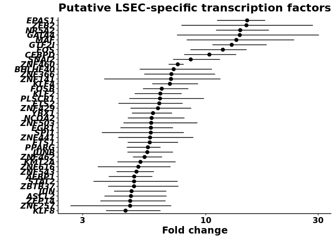

    plot(ctf, aspect = "tfs", tfs = humantfs, celltype = "LSEC", n = 40, units = "fc", colours=c("#FF0000","#00FF00"), labels=c("LSECs","Other ECs"), minimal=F, rotate=T)

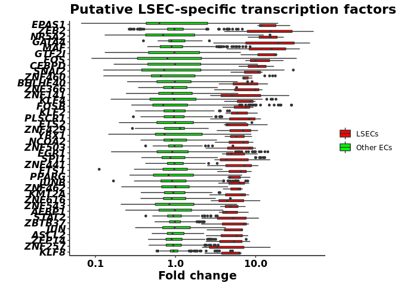

In order to limit the computations needed, the user can restrict the
number of genes to be considered in the analysis. CenTFinder allows the
use of two cut-offs. A first cut-off `TF_range_cutoff` defines the
minimal range of log2(fold change) values of transcription
factors only. For example, if `TF_range_cutoff=1` then any given TF will
only be retained in the analysis if its highest expression value in the
dataset is at least 2`TF_range_cutoff`-fold higher than its
lowest expression value. For this functionality, the user needs to
provide a list of genes that are considered to be transcription factors.
In our example we used the human transcription factors `humantfs` listed
at <http://humantfs.ccbr.utoronto.ca/>. A second cut-off `max_genes`
defines the total number of genes to be retained in the analysis. In the
endothelial cell analysis, 1,449 TFs passed the first cut-off. As we set
`max_genes` to 9000, we included 7,551 (=9000-1,449) non-TF genes in the
analysis.

    ctf<-filterGenes(ctf,tfs=humantfs, TF_range_cutoff=1, max_genes=9000)

At any time point during the analysis, the user can check out the status
of the CenTFinder object by:

    ctf

    ##  
    ##  CenTFinder object
    ##  Expression data: 16248 genes x 279 samples.
    ##  Filtered expression data: 9000 genes x 279 samples.
    ##  Distinct platforms: 4
    ##  Distinct cell types: 36
    ##  Additional differential expression data: None
    ##      
    ##  -----------------------------
    ##  WGCNA
    ##  -----------------------------
    ##  TOM: None
    ##  Soft-thresholding power: None
    ##  Number of modules detected: 0
    ##      
    ##  -----------------------------
    ##  RCisTarget
    ##  -----------------------------
    ##  Motifs detected: None
    ##  Number of TFs with enriched binding motifs: None

We can see that at this point the initial preprocessing and microarray
analysis steps have been performed. The WGCNA and RcisTarget parts are
still empty.

### CenTFinder step 3: Performing gene co-expression analysis with WGCNA

After the previous steps, a clean expression matrix is loaded in the
CenTFinder object `ctf`, which can be subject to gene co-expression
analysis (WGCNA). CenTFinder provides simple wrapper functions for WGCNA
calculations. Applying WGCNA to the expression data is done by running:

    ctf<-applyWGCNA(CenTFinderObject=ctf, network_type="signed")

Next, we need to define modules by cutting the WGCNA cluster dendrogram
and merging similar clusters.

    ctf<-cutDendrogram(ctf, cut_height=0.3)

    plot(ctf, aspect = "cluster dendrogram")

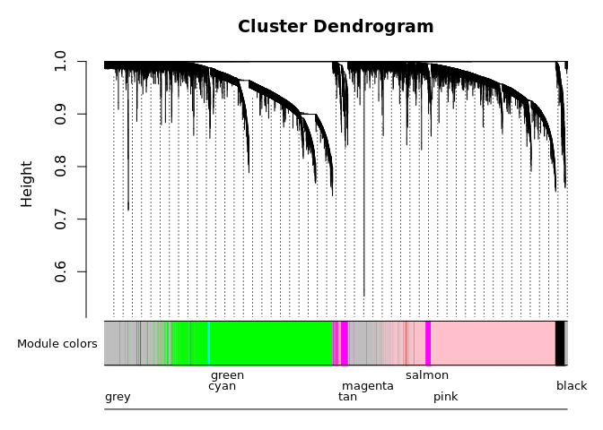

Module colours can be set with:

    ctf<-changeModuleColours(ctf)
    plot(ctf, aspect = "cluster dendrogram")

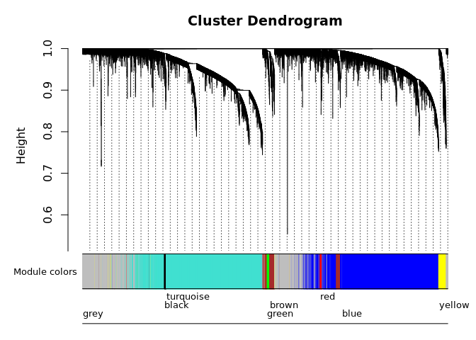

Further info regarding the soft-thresholding applied and the network
topology's approximation to scale-free topology can be extracted by:

    plot(ctf, aspect = "scale independence")

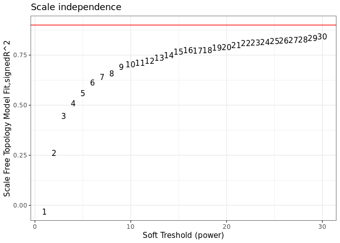

    plot(ctf, aspect = "mean connectivity")

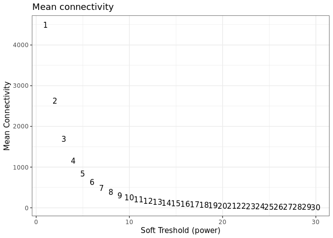

### CenTFinder step 4: Performing module-level analyses

The next step in the workflow allows further analyses on the module gene
sets rather than the full gene set. These analyses include Gene Ontology
enrichment analysis, KEGG pathway enrichment analysis, and transcription
factor binding motif enrichment analysis (RcisTarget). RcisTarget
databases can be downloaded from
<https://resources.aertslab.org/cistarget/>. This step might take a
while depending on your dataset and system.

    data("motifAnnotations_hgnc", package = "RcisTarget")
    library(topGO)
    ctf<-analyseClusters(CenTFinderObject=ctf, 
                         GO=T, 
                         KEGG=T, 
                         PCA=T, 
                         RCisTarget=T,
                         species="Homo sapiens", 
                         cores=parallel::detectCores()-1, 
                         motif_db_path="hg19-tss-centered-10kb-7species.mc9nr.feather")

At this point we can inspect for each module the Gene Ontology and KEGG
pathway enrichments, as well as the module PCA plots.

    plot(ctf, aspect = "module PCA", module = "brown", highlight = "LSEC")

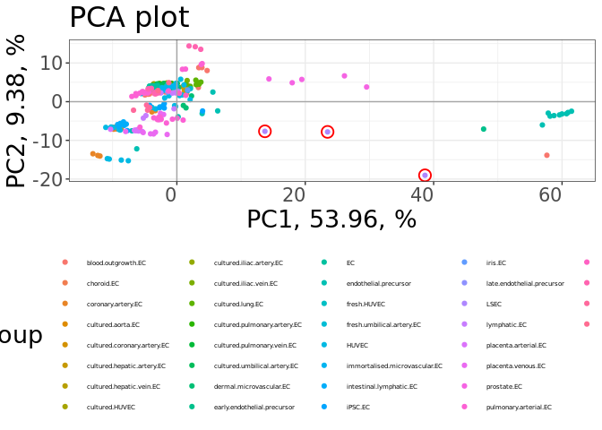

    plot(ctf, aspect = "GO", module = "brown", GO = "BP", GOID=F)

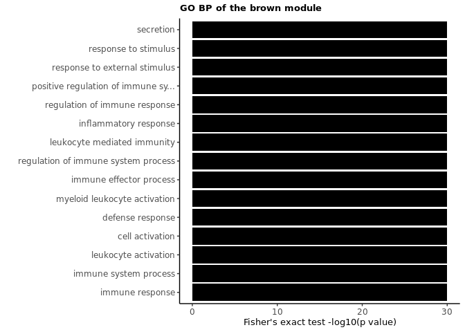

    plot(ctf, aspect = "KEGG", module = "brown")

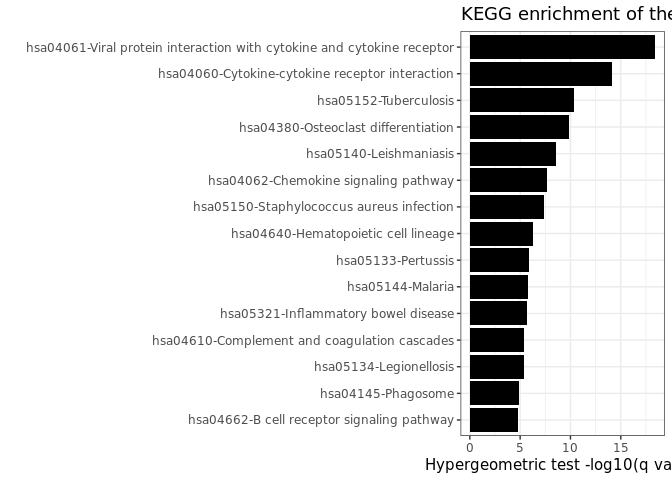

### CenTFinder step 5: Adding additional differential expression data

CenTFinder allows to overlap the identified genes, TFs, and modules with
additional differential expression data. This could be useful to further
contextualise the analysis. For instance, in XXXXXX we overlapped the
genes identified by CenTFinder with the genes that were differentially
expressed between ETV2-ECs and primary LSECs. This allowed us to filter
out a WGCNA module and further focus on the three immune response
modules. If no additional data is available, one could omit this part of
the analysis or one could use differential expression values calculated
between samples in the initial CenTFinder expression matrix.

Additional differential expression data should be provided as a
dataframe (here `rnaseq`) with three columns: "Gene", "logFC", and
"Pvalue". We recommend for the "Pvalue" column to contain p-values after
multiple-test correction (e.g. Benjamini-Hochberg or Bonferroni
correction).

    rnaseq<-read.table("diff_genes_LSEC_vs_ETV2.txt",stringsAsFactors = F,header = T)
    rnaseq<-rnaseq[!is.na(rnaseq$Gene),]
    rnaseq<-rnaseq[log(rnaseq$baseMean)>3,]
    rnaseq<-rnaseq[,c("Gene","log2FoldChange","padj")]
    rnaseq$FC<-2^rnaseq$log2FoldChange
    rnaseq<-rnaseq[,c("Gene", "FC", "padj")]
    names(rnaseq)<-c("Gene", "FC", "Pvalue")
    DEset(ctf)<-rnaseq

### CenTFinder step 6: Integrating the analyses

The final step of the CenTFinder analysis combines and integrates the
gene co-expression analysis, TF binding motif enrichment analysis, and
differential expression analysis. This allows the user to prioritise
TFs, genes, and pathways for the cell type of interest.

    ctf<-integrateAnalyses(CenTFinderObject = ctf, tfs=humantfs, kME_cutoff = 0.5)

Finally, we can visualise the RcisTarget enrichments per cluster as well
as the overlap with the differentially expressed genes from the bulk RNA
sequencing data. We prioritised our wet lab work further on these
identified transcription factors.

    module_annot<-list(turquoise="Development\nFocal adhesions",
                       green="Immune response\nsecretion",
                       black="Cell cycle\n(G1-S transition)",
                       yellow="Cell cycle\n(S-G2-M)",
                       grey="Unclustered genes",
                       red="Immune response\ninflammasomes",
                       brown="Immune response\n(cytokine) signalling",
                       blue="RNA metabolism")

    plot(ctf, aspect = "GSVA boxplot",group="LSEC",module_annot = module_annot, labels = c("LSECs","Other ECs"))

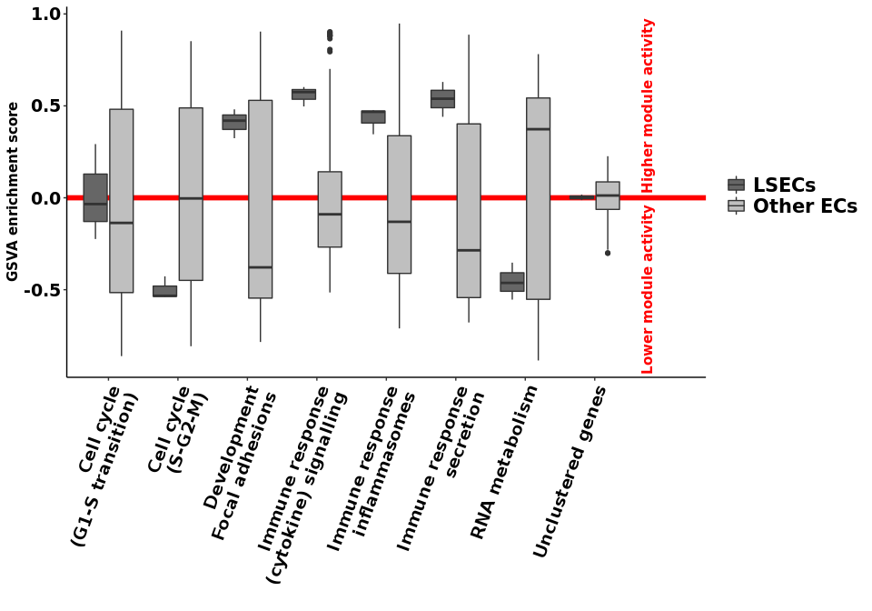

    plot(ctf, aspect = "GSVA heatmap", module_annot = module_annot, traces="none")

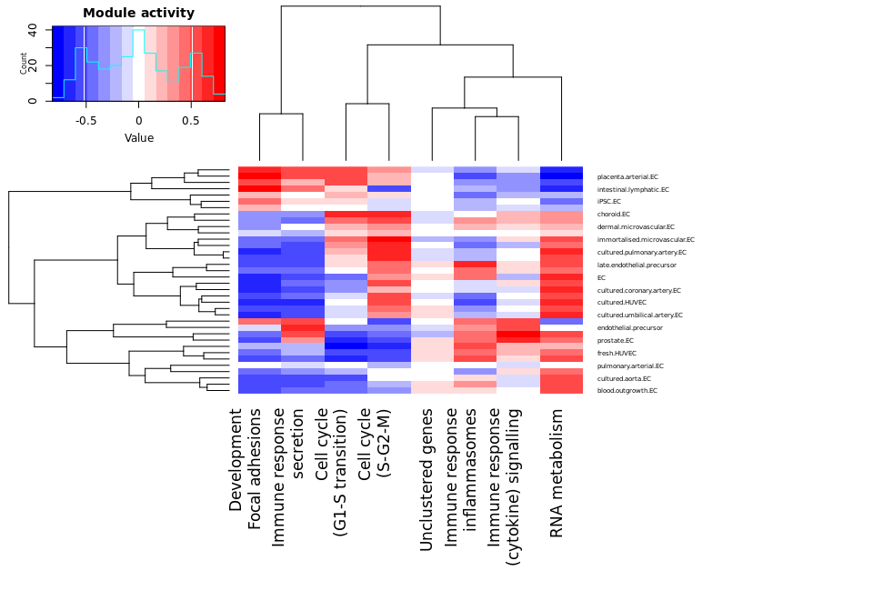

    plot(ctf, aspect = "RcisTarget", module_annot = module_annot, top = 15, topTFs_to_highlight=4)

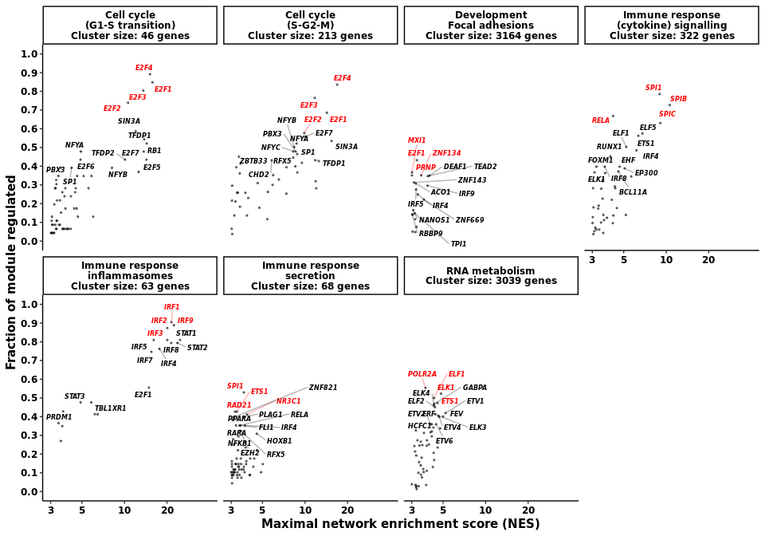

    plot(ctf, aspect = "integrative", module_annot = module_annot,modules=c("green","red","brown"), minFC = 0, minKME = 0.5, topTFs_to_highlight=1)

    ## Warning: Removed 3 rows containing missing values (geom_point).

    ## Warning: Removed 3 rows containing missing values (geom_text_repel).

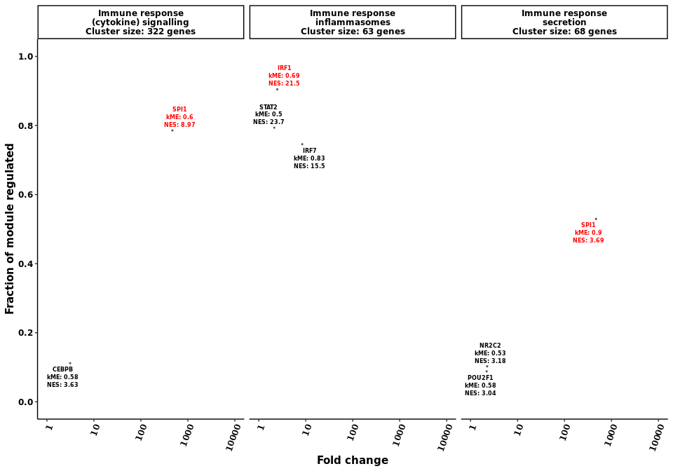

Additionally, the user is able to extract the identified networks and
readily import them into Cytoscape.

    network<-extractNetwork(ctf, modules=c("green","red","brown"))
    head(network)

    ## # A tibble: 6 x 6
    ## # Groups:   TF, Cluster [5]
    ##   Target TF    Cluster nTargets logFC_TF_or_Z_score logFC_Target_Z_score
    ##   <chr>  <chr> <chr>      <int>               <dbl>                <dbl>
    ## 1 ACP5   ETV4  brown         26              0.193                  4.67
    ## 2 ALOX5  RUNX1 brown         63              0.417                228.  
    ## 3 ALOX5  ETV4  brown         26              0.193                228.  
    ## 4 ALOX5  ELF4  brown         45              0.0928               228.  
    ## 5 ALOX5  FOXM1 brown         77              0.187                228.  
    ## 6 ALOX5  ATF5  brown         40              2.52                 228.
